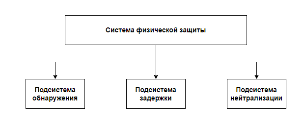

## Содержание и задачи физической защиты объектов информатизации
---
### Защита объекта от НСД нарушителя

**Системы физической защиты** представляют собой совокупность физических, инженерно-технических, организационных мероприятий и действий охранных подразделений, предназначенных для защиты объекта от несанкционированных действий нарушителя.

> Для решения задач проектирования системы физической защиты первоочередной задачей является обследование защищаемого объекта.

В ходе обследования объекта выясняются следующие вопросы:
1. Площадь территории объекта;
2. Количество зданий;
3. Количество локальных зон;
4. Ценность защищаемых ресурсов (формирования перечня активов объекта)
5. Местоположение защищаемых ресурсов в структуре объекта
6. Категории объекта по различным критериям (тех. укрепленность, пожарная безопасность, значимость объектов по функционально-отраслевым признакам)
7. Анализ близлежащих объектов и иные важные аспекты локации объекта защиты

Выбор средств физической защиты объектов производится в соответствии с требованиями нормативно-правовых документов:
- Р 78.36.007-99 ""
- РД 78.36.003-2002 ""
- СП 132.13330.2011 ""
- ГОСТ Р 50776-95 (МЭК 60839-1-4:1989) "Системы тревожной сигнализации".
---
### Цель и задачи физической защиты объекта

**Цель физической защиты объекта -** обеспечение заданного уровня безопасности объекта путем предотвращения несанкционированного доступа на объект физических лиц, транспортных средств и грузов, обнаружения и задержки нарушителей, предотвращения диверсий и чрезвычайных ситуаций.

**Задачи физической защиты объекта**:
1. Предупреждение случаев несанкционированного доступа на объекты предприятия;
2. Своевременное обнаружение несанкционированных действий на территории предприятия;
3. Задержка (замедление) проникновения нарушителя, создание препятствий его действиям;
4. Пресечение несанкционированных действий на территории предприятия;
5. Задержание лиц, причастных к подготовке или совершению диверсии, хищению носителей конфиденциальной информации или иных материальных ценностей предприятия.
---
### Структурная схема СФЗ по решаемым задачам

**Подсистема обнаружения** состоит из внешних и внутренних датчиков, выполняет функции оценки сигнала тревоги, сбора данных о тревоге и их отображения, обеспечивает работу систем контроля на пропускном пункте. **Подсистема задержки** реализует задержку доступа к цели для злоумышленника; **подсистема реагирования** включает силы реагирования и средства связи с ними.

> При защите особо важных объектов применяется **_нейтрализация_** злоумышленника – мера, определяющая результат противоборства сил реагирования и злоумышленника.
---
